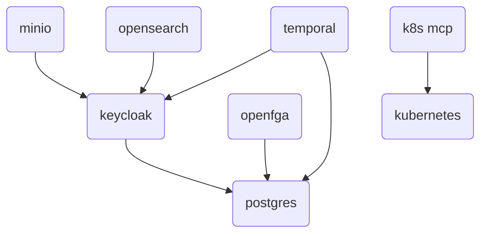

<!-- TODO: Rajouter l'histoire du .env pour templatiser les déploiements  -->
<!-- TODO: Rajouter Kube dashboard dans le kubernetes -->
# Deployment factory for Fred using Docker Compose

The `deployment-factory` repository provides the Docker Compose based deployment setup for the `fred-agent` projects ecosystem. It serves as a centralized environment to orchestrate and run the common infrastructure services required by the other `fred-agent` projects.

This project helps to deploy the following support services:
- **Keycloak** – for authentication and identity management
- **MinIO** – for object storage
- **OpenSearch** – for search and analytics capabilities (including vector store capabilities)
- **OpenFGA** – for relationship-based and fine-grained authorization
- **k3d** - for setting up a dummy kubernetes cluster (used by Fred project only for development purposes)
- **Kubernetes MCP Server** - so that AI agents can interact with Kubernetes clusters
- **Temporal** - for job orchestration
- **Neo4j** - for graph database capabilities (knowledge graphs, relationship querying)

This repository aims to simplify local development and testing by providing a ready-to-use, reproducible environment for all shared dependencies across the `fred-agent` projects.

## Requirements

### Docker Bridge network

All these docker-compose files share the same network called `fred-shared-network`. So first, create the shared network with the following command line.

```
docker network create fred-shared-network --driver bridge
```

### Name resolution (optional)

If the browser used to access Fred's frontend/MinIO console/Opensearch dashboards/... (basically all the UIs that may use Keycloak for SSO) is on the same machine as the one where Keycloak is hosted as a container, please add the entry `127.0.0.1 app-keycloak` into your docker host `/etc/hosts` so that your web browser can reach Keycloak instance for authentication:

```sh
grep -q '127.0.0.1.*app-keycloak' /etc/hosts || echo "127.0.0.1 app-keycloak" | sudo tee -a /etc/hosts
```

## Configuration

Please create a ``.env`` file in the ``docker-compose`` to customize your deployment by copying and adapting the ``docker-compose/.env.template`` file:


```bash
cp docker-compose/.env.template docker-compose/.env
```

Here are **examples** of custom deployment params you can modify:
- ``DOCKER_COMPOSE_HOST_FQDN``
- ``POSTGRES_ADMIN_PASSWORD``
- ``KEYCLOAK_AGENTIC_CLIENT_SECRET``
- ``KEYCLOAK_KNOWLEDGE_FLOW_CLIENT_SECRET``
- ``KEYCLOAK_FORCE_RELOGIN``
- ``OPENFGA_STORE_NAME``
- ``TEMPORAL_UI_PORT``
- ``MINIO_ROOT_USER``
- ``MINIO_ROOT_PASSWORD``
- ``OPENSEARCH_ADMIN_PASSWORD``

## Deployment


All these services can be started separately.

Keycloak is already configured with some clients, roles and users.

Minio and Opensearch are already configured to be connected to Keycloak. This is a graph to show the dependencies between compose files:



Launch the components according to your needs with these command lines:

- Keycloak
```
docker compose -f docker-compose/docker-compose-keycloak.yml -p keycloak up -d
bash docker-compose/keycloak/keycloak-post-install.sh
```

The Keycloak post-install script is idempotent and enforces:
- clients `app`, `agentic`, `knowledge-flow`
- `agentic` and `knowledge-flow` as confidential clients with service accounts enabled
- service account roles for `agentic` and `knowledge-flow` (`realm-management` + `account:view-groups`, including `manage-users` for Knowledge Flow when `KEYCLOAK_KF_ENABLE_MANAGE_USERS=true`)
- client roles `app:admin/editor/viewer`
- client scope `groups-scope` with `oidc-group-membership-mapper` (claim `groups`, full path, access/id/userinfo token claims, multivalued)
- `groups-scope` attached to default scopes of the `app` client
- forced user re-login after a Keycloak wipe (`KEYCLOAK_FORCE_RELOGIN=auto` or `true`)

- OpenFGA
```
docker compose -f docker-compose/docker-compose-openfga.yml -p openfga up -d
bash docker-compose/openfga/openfga-post-install.sh
```

The OpenFGA post-install script is idempotent and enforces:
- store `OPENFGA_STORE_NAME` (default: `fred`)
- authorization model from `docker-compose/openfga/openfga-model.json`
- seeded team memberships from `helm/fred-stack/files/openfga/openfga-seed.json` (shared with the Helm/k3d variant)
- user tuples based on Keycloak users (`alice`, `bob`, `phil`) using their realm user IDs
- optional additional tuples with username subjects when `OPENFGA_SEED_INCLUDE_USERNAME_USERS=true`

To change users or teams, edit:
- `helm/fred-stack/files/openfga/openfga-seed.json`

The docker post-install script also supports `OPENFGA_SEED_FILE=/custom/path.json` if you need a temporary override.

<!-- TODO: Need to check how we can specify hard dependency between Keycloak and depending services (MinIO & Opensearch) -->

- MinIO
```
docker compose -f docker-compose/docker-compose-minio.yml -p minio up -d
```

- OpenSearch
```
docker compose -f docker-compose/docker-compose-opensearch.yml -p opensearch up -d
```


- Lightweight Kubernetes distribution (k3d)
```
docker compose -f docker-compose/docker-compose-kubernetes.yml -p kubernetes up -d
```

- Kubernetes MCP Server
```
docker compose -f docker-compose/docker-compose-k8s-mcp.yml -p k8s-mcp up -d
```

- Temporal
```
docker compose -f docker-compose/docker-compose-temporal.yml -p temporal up -d
```

- Neo4j
```
docker compose -f docker-compose/docker-compose-neo4j.yml -p neo4j up -d
```

## Access the service interfaces

> :key: For development purposes, the password for nominative or service accounts is `Azerty123_`

Hereunder these are _the nominative SSO accounts_ registered into the Keycloak realm and their roles:

  - ``alice`` (role: ``admin``)
  - ``bob`` (roles: ``editor``, ``viewer``)
  - ``phil`` (role: ``viewer``)

Hereunder, these are the information to connect to each service with their _local service accounts_.

### Keycloak

- URL: http://$(DOCKER_COMPOSE_HOST_FQDN):8080
- Service accounts:
  - `admin`
- Realm: `app`

### OpenFGA

- APIs:
  - http://$(DOCKER_COMPOSE_HOST_FQDN):3000/playground (Playground UI)
  - http://$(DOCKER_COMPOSE_HOST_FQDN):9080 (HTTP API)
  - grpc://$(DOCKER_COMPOSE_HOST_FQDN):9081 (gRPC API)

### MinIO:

- URLs:
  - http://$(DOCKER_COMPOSE_HOST_FQDN):9001 (web)
  - http://$(DOCKER_COMPOSE_HOST_FQDN):9000 (service)
- Service accounts:
  - `admin` (admin)
  - `app_ro` (read-only)
  - `app_rw` (read-write)
 - Buckets:
   - `app-content`
   - `app-feedback`

### OpenSearch

- URLs:
  - http://$(DOCKER_COMPOSE_HOST_FQDN):5601 (dashboard)
  - https://$(DOCKER_COMPOSE_HOST_FQDN):9200 (service)
- Service accounts:
  - `admin` (admin)
  - `app_ro` (read-only)
  - `app_rw` (read-write)
 - Indexes:
   - `metadata-index`
   - `vector-index`
   - `active-sessions-index`
   - `chat-interactions-index`

### Temporal

- URLs:
  - http://$(DOCKER_COMPOSE_HOST_FQDN):$(TEMPORAL_UI_PORT) (web-ui, default: `8233`)

### Neo4j

- URLs:
  - http://$(DOCKER_COMPOSE_HOST_FQDN):7474 (Browser / HTTP API)
  - bolt://$(DOCKER_COMPOSE_HOST_FQDN):7687 (Bolt protocol)
- Service accounts:
  - `neo4j` (default superuser)
