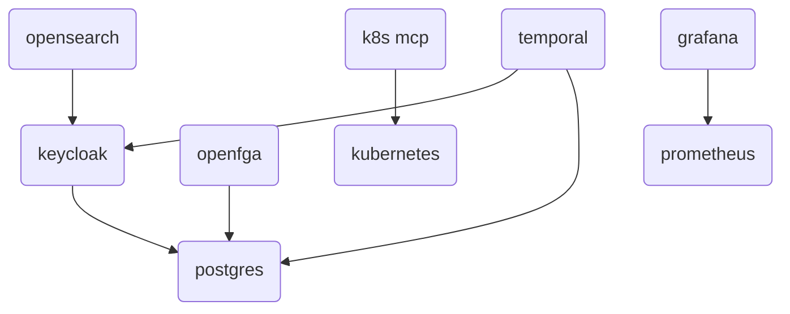

<!-- TODO: Rajouter l'histoire du .env pour templatiser les déploiements  -->
<!-- TODO: Rajouter Kube dashboard dans le kubernetes -->
# Deployment factory for Fred using Docker Compose

The `deployment-factory` repository provides the Docker Compose based deployment setup for the `fred-agent` projects ecosystem. It serves as a centralized environment to orchestrate and run the common infrastructure services required by the other `fred-agent` projects.

This project helps to deploy the following support services:
- **Keycloak** – for authentication and identity management
- **SeaweedFS** – for S3-compatible object storage
- **OpenSearch** – for search and analytics capabilities (including vector store capabilities)
- **OpenFGA** – for relationship-based and fine-grained authorization
- **k3d** - for setting up a dummy kubernetes cluster (used by Fred project only for development purposes)
- **Kubernetes MCP Server** - so that AI agents can interact with Kubernetes clusters
- **Temporal** - for job orchestration
- **Neo4j** - for graph database capabilities (knowledge graphs, relationship querying)
- **Prometheus** - for metrics collection and scraping
- **Grafana** - for dashboards and metrics visualization

This repository aims to simplify local development and testing by providing a ready-to-use, reproducible environment for all shared dependencies across the `fred-agent` projects.

## Requirements

### Docker Bridge network

All these docker-compose files share the same network called `fred-shared-network`. So first, create the shared network with the following command line.

```
docker network create fred-shared-network --driver bridge
```

### Name resolution (optional)

If the browser used to access Fred's frontend or OpenSearch dashboards (basically all the UIs that may use Keycloak for SSO) is on the same machine as the one where Keycloak is hosted as a container, please add the entry `127.0.0.1 app-keycloak` into your docker host `/etc/hosts` so that your web browser can reach Keycloak instance for authentication:

```sh
grep -q '127.0.0.1.*app-keycloak' /etc/hosts || echo "127.0.0.1 app-keycloak" | sudo tee -a /etc/hosts
```

## Configuration

Please create a ``.env`` file in the ``docker-compose`` to customize your deployment by copying and adapting the ``docker-compose/.env.template`` file:


```bash
cp docker-compose/.env.template docker-compose/.env
```

Here are **examples** of custom deployment params you can modify:
- ``DOCKER_COMPOSE_HOST_FQDN``
- ``POSTGRES_ADMIN_PASSWORD``
- ``POSTGRES_MAX_CONNECTIONS``
- ``KEYCLOAK_AGENTIC_CLIENT_SECRET``
- ``KEYCLOAK_KNOWLEDGE_FLOW_CLIENT_SECRET``
- ``KEYCLOAK_CONTROL_PLANE_CLIENT_SECRET``
- ``KEYCLOAK_FORCE_RELOGIN``
- ``OPENFGA_STORE_NAME``
- ``TEMPORAL_UI_PORT``
- ``SEAWEEDFS_ADMIN_USER``
- ``SEAWEEDFS_ADMIN_PASSWORD``
- ``OPENSEARCH_ADMIN_PASSWORD``
- ``PROMETHEUS_PORT``
- ``PROMETHEUS_RETENTION``
- ``GRAFANA_PORT``
- ``GRAFANA_ADMIN_USER``
- ``GRAFANA_ADMIN_PASSWORD``

## Deployment


All these services can be started separately.

Keycloak is already configured with some clients, roles and users.

OpenSearch is already configured to be connected to Keycloak. This is a graph to show the dependencies between compose files:


```mermaid
graph TB
A(keycloak) --> E(postgres)
C(opensearch) --> A(keycloak)
I(openfga) --> E(postgres)
H(temporal) --> A(keycloak)
H(temporal) --> E(postgres)
F(k8s mcp) --> G(kubernetes)
J(prometheus)
K(grafana) --> J(prometheus)
```

Launch the components according to your needs with these command lines:

- Keycloak
```
docker compose -f docker-compose/docker-compose-keycloak.yml -p keycloak up -d
bash docker-compose/keycloak/keycloak-post-install.sh
```

The Keycloak post-install script is idempotent, mode-aware (`AUTHZ_MODE=swift-clean` by
default, `AUTHZ_MODE=kea-legacy` with `WITH_KEA=true`), and enforces:
- clients `app`, `agentic`, `knowledge-flow`, `control-plane`
- `agentic`, `knowledge-flow`, and `control-plane` as confidential clients with service accounts enabled
- service account roles for `agentic`, `knowledge-flow`, and `control-plane`: `realm-management`
  `query-users`/`view-users` (plus `manage-users` for `control-plane` always, and for
  `knowledge-flow` when `KEYCLOAK_KF_ENABLE_MANAGE_USERS=true`). No group-scoped role
  (`query-groups`/`view-groups`) is granted in either mode - no app calls a Keycloak
  group-admin API (AUTHZ-05/06: OpenFGA is the sole authorization source).
- client roles `app:admin/editor/viewer/service_agent` (definitions remain for service/legacy compatibility; clean Swift demo users receive no app roles)
- demo users from the active demo identity config (`config/configuration.yaml` by default,
  `config/configuration.kea.yaml` with `WITH_KEA=true`)
- **`AUTHZ_MODE=swift-clean` (default):** no Keycloak group is created for a team - a Swift
  team is a `team_metadata` row + OpenFGA relations, created later via the control-plane
  APIs (see `validation/README.md`). No `groups-scope` client scope or
  `oidc-group-membership-mapper` is created or attached to the `app` client; if a prior
  `WITH_KEA=true` run left one attached, it is detached (its absence is expected, not an
  error).
- **`AUTHZ_MODE=kea-legacy` (`WITH_KEA=true`):** demo groups (one per team) and group
  memberships from the active demo identity config, plus the `groups-scope` client scope
  with `oidc-group-membership-mapper` (claim `groups`, full path, access/id/userinfo token
  claims, multivalued) attached to the `app` client's default scopes - the old world the
  migration rehearsal translates from.
- forced user re-login after a Keycloak wipe (`KEYCLOAK_FORCE_RELOGIN=auto` or `true`)

- OpenFGA
```
docker compose -f docker-compose/docker-compose-openfga.yml -p openfga up -d
bash docker-compose/openfga/openfga-post-install.sh
```

The OpenFGA post-install script is idempotent, mode-aware (`AUTHZ_MODE=swift-clean` by
default, `AUTHZ_MODE=kea-legacy` with `WITH_KEA=true`), and enforces:
- store `OPENFGA_STORE_NAME` (default: `fred`)
- authorization model from the active model file (`docker-compose/openfga/openfga-model.json`
  by default - kept byte-identical to `fred-core`'s `schema.fga.json` by `make
  sync-openfga-model` / `make check-openfga-model-sync` - or
  `docker-compose/openfga/openfga-model.kea.json` with `WITH_KEA=true`)
- platform tuples (`platform_admin`/`platform_observer` on `organization:fred`) from the
  active demo identity config's `platform_roles`, in both modes
- **`AUTHZ_MODE=swift-clean` (default):** no team-role tuple is seeded here. A Swift
  `team:<id>` only exists once the control-plane creates the `team_metadata` row
  (`POST /teams`), so there is no Keycloak group to resolve a team id from at this stage -
  team roles (`team_admin`/`team_editor`/`team_analyst`/`team_member`) are bootstrapped
  later via the real control-plane APIs by
  `validation/conftest.py::_bootstrap_collaborative_teams`, never derived from a Keycloak
  group.
- **`AUTHZ_MODE=kea-legacy` (`WITH_KEA=true`):** team tuples (`member`/`manager`/`owner`)
  seeded from the active demo identity config, resolving each team name to its Keycloak
  group id - the old world the migration rehearsal translates from.
- optional additional tuples with username subjects when `OPENFGA_SEED_INCLUDE_USERNAME_USERS=true`

To change demo users / roles / teams, edit:
- `config/configuration.yaml` for the clean Swift default
- `config/configuration.kea.yaml` for the legacy Kea rehearsal (`WITH_KEA=true`)

The docker post-install scripts also support `DEMO_IDENTITY_CONFIG_FILE=/custom/path.json` if you need a temporary override.

<!-- TODO: Need to check how we can specify hard dependency between Keycloak and depending services (OpenSearch, Temporal, OpenFGA) -->

- SeaweedFS
```
docker compose -f docker-compose/docker-compose-seaweedfs.yml -p seaweedfs up -d
```

The SeaweedFS post-install job pre-creates the bucket `langfuse`.

- OpenSearch
```
docker compose -f docker-compose/docker-compose-opensearch.yml -p opensearch up -d
```


- Lightweight Kubernetes distribution (k3d)
```
docker compose -f docker-compose/docker-compose-kubernetes.yml -p kubernetes up -d
```

- Kubernetes MCP Server
```
docker compose -f docker-compose/docker-compose-k8s-mcp.yml -p k8s-mcp up -d
```

- Temporal
```
docker compose -f docker-compose/docker-compose-temporal.yml -p temporal up -d
```

- Neo4j
```
docker compose -f docker-compose/docker-compose-neo4j.yml -p neo4j up -d
```

- Prometheus
```
docker compose -f docker-compose/docker-compose-prometheus.yml -p prometheus up -d
```

- Grafana
```
docker compose -f docker-compose/docker-compose-grafana.yml -p grafana up -d
```

Prometheus starts with self-scraping enabled and can load additional static targets from `docker-compose/prometheus/targets/*.yml`.
It also scrapes the native metrics endpoints exposed in Docker Compose mode for:
- `Keycloak` on `app-keycloak:9000/metrics`
- `OpenFGA` on `openfga:2112/metrics`
- `ClickHouse` on `app-clickhouse:9363/metrics`
- `Temporal` on `app-temporal:9090/metrics`
- `SeaweedFS` on `app-seaweedfs:9327/metrics`

Grafana is pre-provisioned with a Prometheus datasource pointing to `http://app-prometheus:9090` on the shared Docker network.

## Access the service interfaces

> :key: For development purposes, the password for nominative or service accounts is `Azerty123_`

Hereunder these are examples of _the nominative SSO accounts_ registered into the Keycloak realm.
In the clean Swift default, Keycloak only carries the identity (username/email/password);
user authorization roles are seeded in OpenFGA, never as Keycloak app roles or groups:

  - ``alice``: OpenFGA ``platform_admin``, no team membership - seeded directly by
    `make docker-up` (platform tuples only need a Keycloak `sub`, no team to exist yet).
  - ``gabriel``: OpenFGA ``platform_observer``, no team membership - same as alice.
  - ``bob``: OpenFGA ``team_editor`` for ``northbridge`` and ``fredlab``
  - ``marc``: OpenFGA ``team_admin`` for ``fredlab``

Unlike the platform tuples, `bob`'s and `marc`'s team-role tuples above are **not** written by
`make docker-up` itself: a Swift team only exists once the control-plane creates its
`team_metadata` row, so they appear the first time the validation harness (or any control-plane
client) bootstraps `fredlab`/`northbridge` through `POST /teams` and the team-role APIs - see
[`../validation/README.md`](../validation/README.md). Run ``make docker-up WITH_KEA=true`` for
the legacy rehearsal seed with Keycloak groups and ``admin/editor/viewer`` app roles.

Hereunder, these are the information to connect to each service with their _local service accounts_.

### Keycloak

- URL: http://$(DOCKER_COMPOSE_HOST_FQDN):8080
- Service accounts:
  - `admin`
- Realm: `app`

### OpenFGA

- APIs:
  - http://$(DOCKER_COMPOSE_HOST_FQDN):3000/playground (Playground UI)
  - http://$(DOCKER_COMPOSE_HOST_FQDN):9080 (HTTP API)
  - grpc://$(DOCKER_COMPOSE_HOST_FQDN):9081 (gRPC API)

### ClickHouse

- URLs:
  - http://$(DOCKER_COMPOSE_HOST_FQDN):8123 (HTTP API)
  - http://$(DOCKER_COMPOSE_HOST_FQDN):8123/play (built-in SQL UI)
  - tcp://$(DOCKER_COMPOSE_HOST_FQDN):9002 (native protocol)
- Service accounts:
  - `${CLICKHOUSE_USER}` (default from `.env.template`: `fred`)

### Langfuse

- URLs:
  - http://$(DOCKER_COMPOSE_HOST_FQDN):$(LANGFUSE_UI_PORT) (web-ui, default: `3001`)
- S3 bucket (default in `.env.template`):
  - `LANGFUSE_S3_EVENT_UPLOAD_BUCKET=langfuse`
  - `LANGFUSE_S3_MEDIA_UPLOAD_BUCKET=langfuse`
  - `LANGFUSE_S3_BATCH_EXPORT_BUCKET=langfuse`
- First-time setup:
  - Create your user account from the Langfuse UI (`Sign up`).
  - Create an organization.
  - Create a project in that organization.
  - Generate API keys in `Settings` -> `Projects` -> `<Project name>` -> `API Keys`.
  - Use the generated values as `LANGFUSE_PUBLIC_KEY` and `LANGFUSE_SECRET_KEY` in your environment variable file, typically `.env` in Fred.

### Grafana

- URL:
  - http://$(DOCKER_COMPOSE_HOST_FQDN):$(GRAFANA_PORT) (default: `3002`)
- Default admin account:
  - `${GRAFANA_ADMIN_USER}` / `${GRAFANA_ADMIN_PASSWORD}`

### SeaweedFS

- URLs:
  - http://$(DOCKER_COMPOSE_HOST_FQDN):8333 (S3 API)
  - http://$(DOCKER_COMPOSE_HOST_FQDN):8888 (Filer API)
  - http://$(DOCKER_COMPOSE_HOST_FQDN):9333 (Master API)
  - http://$(DOCKER_COMPOSE_HOST_FQDN):8081 (Volume API)
- Note:
  - the SeaweedFS Volume API is intentionally exposed on host port `8081` because host port `8080` is already used by Keycloak
- Service accounts:
  - `admin` (admin)
- Buckets:
   - `langfuse`

### OpenSearch

- URLs:
  - http://$(DOCKER_COMPOSE_HOST_FQDN):5601 (dashboard)
  - https://$(DOCKER_COMPOSE_HOST_FQDN):9200 (service)
- Service accounts:
  - `admin` (admin)
  - `app_ro` (read-only)
  - `app_rw` (read-write)
 - Indexes:
   - `metadata-index`
   - `vector-index`
   - `active-sessions-index`
   - `chat-interactions-index`

### Temporal

- URLs:
  - http://$(DOCKER_COMPOSE_HOST_FQDN):$(TEMPORAL_UI_PORT) (web-ui, default: `8233`)

### Neo4j

- URLs:
  - http://$(DOCKER_COMPOSE_HOST_FQDN):7474 (Browser / HTTP API)
  - bolt://$(DOCKER_COMPOSE_HOST_FQDN):7687 (Bolt protocol)
- Service accounts:
  - `neo4j` (default superuser)

### Prometheus

- URLs:
  - http://$(DOCKER_COMPOSE_HOST_FQDN):$(PROMETHEUS_PORT) (web UI / API, default: `9090`)
