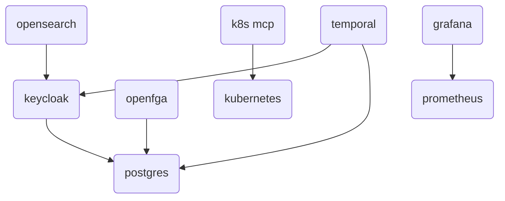

<!-- TODO: Rajouter l'histoire du .env pour templatiser les déploiements  -->
<!-- TODO: Rajouter Kube dashboard dans le kubernetes -->
# Deployment factory for Fred using Docker Compose

The `deployment-factory` repository provides the Docker Compose based deployment setup for the `fred-agent` projects ecosystem. It serves as a centralized environment to orchestrate and run the common infrastructure services required by the other `fred-agent` projects.

This project helps to deploy the following support services:
- **Keycloak** – for authentication and identity management
- **SeaweedFS** – for S3-compatible object storage
- **OpenSearch** – for search and analytics capabilities (including vector store capabilities)
- **OpenFGA** – for relationship-based and fine-grained authorization
- **k3d** - for setting up a dummy kubernetes cluster (used by Fred project only for development purposes)
- **Kubernetes MCP Server** - so that AI agents can interact with Kubernetes clusters
- **Temporal** - for job orchestration
- **Neo4j** - for graph database capabilities (knowledge graphs, relationship querying)
- **Prometheus** - for metrics collection and scraping
- **Grafana** - for dashboards and metrics visualization

This repository aims to simplify local development and testing by providing a ready-to-use, reproducible environment for all shared dependencies across the `fred-agent` projects.

## Requirements

### Docker Bridge network

All these docker-compose files share the same network called `fred-shared-network`. So first, create the shared network with the following command line.

```
docker network create fred-shared-network --driver bridge
```

### Name resolution (optional)

If the browser used to access Fred's frontend or OpenSearch dashboards (basically all the UIs that may use Keycloak for SSO) is on the same machine as the one where Keycloak is hosted as a container, please add the entry `127.0.0.1 app-keycloak` into your docker host `/etc/hosts` so that your web browser can reach Keycloak instance for authentication:

```sh
grep -q '127.0.0.1.*app-keycloak' /etc/hosts || echo "127.0.0.1 app-keycloak" | sudo tee -a /etc/hosts
```

## Configuration

Please create a ``.env`` file in the ``docker-compose`` to customize your deployment by copying and adapting the ``docker/.env.template`` file:


```bash
cp docker/.env.template docker/.env
```

Here are **examples** of custom deployment params you can modify:
- ``DOCKER_COMPOSE_HOST_FQDN``
- ``POSTGRES_ADMIN_PASSWORD``
- ``POSTGRES_MAX_CONNECTIONS``
- ``KEYCLOAK_AGENTIC_CLIENT_SECRET``
- ``KEYCLOAK_KNOWLEDGE_FLOW_CLIENT_SECRET``
- ``KEYCLOAK_CONTROL_PLANE_CLIENT_SECRET``
- ``KEYCLOAK_FORCE_RELOGIN``
- ``OPENFGA_STORE_NAME``
- ``TEMPORAL_UI_PORT``
- ``SEAWEEDFS_ADMIN_USER``
- ``SEAWEEDFS_ADMIN_PASSWORD``
- ``OPENSEARCH_ADMIN_PASSWORD``
- ``PROMETHEUS_PORT``
- ``PROMETHEUS_RETENTION``
- ``GRAFANA_PORT``
- ``GRAFANA_ADMIN_USER``
- ``GRAFANA_ADMIN_PASSWORD``

## Deployment


All these services can be started separately.

Keycloak is already configured with some clients and roles - no users are pre-provisioned.

OpenSearch is already configured to be connected to Keycloak. This is a graph to show the dependencies between compose files:



Launch the components according to your needs with these command lines:

- Keycloak
```
docker compose -f docker/docker-compose-keycloak.yml -p keycloak up -d
bash docker/keycloak/keycloak-post-install.sh
```

The Keycloak post-install script is idempotent and enforces:
- clients `app`, `agentic`, `knowledge-flow`, `control-plane`
- `agentic`, `knowledge-flow`, and `control-plane` as confidential clients with service accounts enabled
- service account roles for `agentic`, `knowledge-flow`, and `control-plane`: `realm-management`
  `query-users`/`view-users` (plus `manage-users` for `control-plane` always, and for
  `knowledge-flow` when `KEYCLOAK_KF_ENABLE_MANAGE_USERS=true`). No group-scoped role
  (`query-groups`/`view-groups`) is ever granted - no app calls a Keycloak group-admin API
  (AUTHZ-05/06: OpenFGA is the sole authorization source).
- client roles `app:admin/editor/viewer/service_agent` (definitions remain for service/legacy
  compatibility; nothing in Fred assigns them - team and platform roles live in OpenFGA, never
  as Keycloak app roles or groups)
- an **empty realm**: zero demo users, zero groups. Self-registration is enabled on the `app`
  client, so the first human simply registers through Keycloak's own registration screen.
- forced user re-login after a Keycloak wipe (`KEYCLOAK_FORCE_RELOGIN=auto` or `true`)

- OpenFGA
```
docker compose -f docker/docker-compose-openfga.yml -p openfga up -d
bash docker/openfga/openfga-post-install.sh
```

The OpenFGA post-install script is idempotent and enforces:
- store `OPENFGA_STORE_NAME` (default: `fred`)
- authorization model from `docker/openfga/openfga-model.json` - kept in sync with
  `fred-core`'s `schema.fga.json` by `make sync-openfga-model` / `make
  check-openfga-model-sync`, which compare normalized JSON (`json.dumps(...,
  sort_keys=True)`), not raw file bytes.
- an **empty store**: zero tuples. There is no demo identity config left in this repo to seed
  from - `fred-deployment-factory` is pure infrastructure now. The very first `platform_admin`
  goes through `POST /bootstrap/platform-admin` (AUTHZ-07) - see the root README.

### Platform and demo-data provisioning now lives in `fred`

This repo no longer carries any user, team, or role data - not even for local demos. Identity
and authorization provisioning (both the Keycloak users *and* every team/platform role) is
owned entirely by `fred`/control-plane-backend's declarative platform-import feature
(`POST /import-export/import`, `CAN_MANAGE_PLATFORM`-gated):

- The canonical demo dataset is
  `apps/control-plane-backend/tests/fixtures/import_export/demo_provisioning/` in the `fred`
  monorepo (`manifest.json` + `users.json`) - the single source of truth for every demo
  identity and every team/platform role, replacing this repo's old
  `config/configuration*.yaml` files.
- `cd apps/control-plane-backend && make build-demo-bundle` packages that fixture into
  `target/demo-provisioning-bundle.zip`.
- Upload it from **Admin → Migration** in the Fred UI (or run it against
  `apps/control-plane-backend`'s import CLI/test tooling) - one import call creates any
  missing Keycloak identity and grants every configured team/platform role.

See `docs/swift/rfc/PLATFORM-IMPORT-RFC.md` §10 in the `fred` monorepo for the full contract.

<!-- TODO: Need to check how we can specify hard dependency between Keycloak and depending services (OpenSearch, Temporal, OpenFGA) -->

- SeaweedFS
```
docker compose -f docker/docker-compose-seaweedfs.yml -p seaweedfs up -d
```

The SeaweedFS post-install job pre-creates the bucket `langfuse`.

- OpenSearch
```
docker compose -f docker/docker-compose-opensearch.yml -p opensearch up -d
```


- Lightweight Kubernetes distribution (k3d)
```
docker compose -f docker/docker-compose-kubernetes.yml -p kubernetes up -d
```

- Kubernetes MCP Server
```
docker compose -f docker/docker-compose-k8s-mcp.yml -p k8s-mcp up -d
```

- Temporal
```
docker compose -f docker/docker-compose-temporal.yml -p temporal up -d
```

- Neo4j
```
docker compose -f docker/docker-compose-neo4j.yml -p neo4j up -d
```

- Prometheus
```
docker compose -f docker/docker-compose-prometheus.yml -p prometheus up -d
```

- Grafana
```
docker compose -f docker/docker-compose-grafana.yml -p grafana up -d
```

Prometheus starts with self-scraping enabled and can load additional static targets from `docker/prometheus/targets/*.yml`.
It also scrapes the native metrics endpoints exposed in Docker Compose mode for:
- `Keycloak` on `app-keycloak:9000/metrics`
- `OpenFGA` on `openfga:2112/metrics`
- `ClickHouse` on `app-clickhouse:9363/metrics`
- `Temporal` on `app-temporal:9090/metrics`
- `SeaweedFS` on `app-seaweedfs:9327/metrics`

Grafana is pre-provisioned with a Prometheus datasource pointing to `http://app-prometheus:9090` on the shared Docker network.

## Access the service interfaces

> :key: For development purposes, the password for nominative or service accounts is `Azerty123_`

`make docker-up` alone creates **no** nominative account - the Keycloak realm and the OpenFGA
store are both empty. To get working accounts, either:

- self-register through Keycloak's own registration screen, then complete the AUTHZ-07
  `/bootstrap` flow to become the first `platform_admin`; or
- upload `fred`'s demo-provisioning bundle from **Admin → Migration** (see "Platform and
  demo-data provisioning now lives in `fred`" above), which creates the same example accounts
  this repo used to seed directly - e.g. ``alice`` (OpenFGA ``platform_admin``), ``gabriel``
  (OpenFGA ``platform_observer``), ``bob`` (OpenFGA ``team_editor`` for ``northbridge`` and
  ``fredlab``), ``marc`` (OpenFGA ``team_admin`` for ``fredlab``) - all with the standard
  `Azerty123_` password. Keycloak only ever carries the identity (username/email/password);
  every authorization role lives in OpenFGA, never as a Keycloak app role or group.

Hereunder, these are the information to connect to each service with their _local service accounts_.

### Keycloak

- URL: http://$(DOCKER_COMPOSE_HOST_FQDN):8080
- Service accounts:
  - `admin`
- Realm: `app`

### OpenFGA

- APIs:
  - http://$(DOCKER_COMPOSE_HOST_FQDN):3000/playground (Playground UI)
  - http://$(DOCKER_COMPOSE_HOST_FQDN):9080 (HTTP API)
  - grpc://$(DOCKER_COMPOSE_HOST_FQDN):9081 (gRPC API)

### ClickHouse

- URLs:
  - http://$(DOCKER_COMPOSE_HOST_FQDN):8123 (HTTP API)
  - http://$(DOCKER_COMPOSE_HOST_FQDN):8123/play (built-in SQL UI)
  - tcp://$(DOCKER_COMPOSE_HOST_FQDN):9002 (native protocol)
- Service accounts:
  - `${CLICKHOUSE_USER}` (default from `.env.template`: `fred`)

### Langfuse

- URLs:
  - http://$(DOCKER_COMPOSE_HOST_FQDN):$(LANGFUSE_UI_PORT) (web-ui, default: `3001`)
- S3 bucket (default in `.env.template`):
  - `LANGFUSE_S3_EVENT_UPLOAD_BUCKET=langfuse`
  - `LANGFUSE_S3_MEDIA_UPLOAD_BUCKET=langfuse`
  - `LANGFUSE_S3_BATCH_EXPORT_BUCKET=langfuse`
- First-time setup:
  - Create your user account from the Langfuse UI (`Sign up`).
  - Create an organization.
  - Create a project in that organization.
  - Generate API keys in `Settings` -> `Projects` -> `<Project name>` -> `API Keys`.
  - Use the generated values as `LANGFUSE_PUBLIC_KEY` and `LANGFUSE_SECRET_KEY` in your environment variable file, typically `.env` in Fred.

### Grafana

- URL:
  - http://$(DOCKER_COMPOSE_HOST_FQDN):$(GRAFANA_PORT) (default: `3002`)
- Default admin account:
  - `${GRAFANA_ADMIN_USER}` / `${GRAFANA_ADMIN_PASSWORD}`

### SeaweedFS

- URLs:
  - http://$(DOCKER_COMPOSE_HOST_FQDN):8333 (S3 API)
  - http://$(DOCKER_COMPOSE_HOST_FQDN):8888 (Filer API)
  - http://$(DOCKER_COMPOSE_HOST_FQDN):9333 (Master API)
  - http://$(DOCKER_COMPOSE_HOST_FQDN):8081 (Volume API)
- Note:
  - the SeaweedFS Volume API is intentionally exposed on host port `8081` because host port `8080` is already used by Keycloak
- Service accounts:
  - `admin` (admin)
- Buckets:
   - `langfuse`

### OpenSearch

- URLs:
  - http://$(DOCKER_COMPOSE_HOST_FQDN):5601 (dashboard)
  - https://$(DOCKER_COMPOSE_HOST_FQDN):9200 (service)
- Service accounts:
  - `admin` (admin)
  - `app_ro` (read-only)
  - `app_rw` (read-write)
 - Indexes:
   - `metadata-index`
   - `vector-index`
   - `active-sessions-index`
   - `chat-interactions-index`

### Temporal

- URLs:
  - http://$(DOCKER_COMPOSE_HOST_FQDN):$(TEMPORAL_UI_PORT) (web-ui, default: `8233`)

### Neo4j

- URLs:
  - http://$(DOCKER_COMPOSE_HOST_FQDN):7474 (Browser / HTTP API)
  - bolt://$(DOCKER_COMPOSE_HOST_FQDN):7687 (Bolt protocol)
- Service accounts:
  - `neo4j` (default superuser)

### Prometheus

- URLs:
  - http://$(DOCKER_COMPOSE_HOST_FQDN):$(PROMETHEUS_PORT) (web UI / API, default: `9090`)
