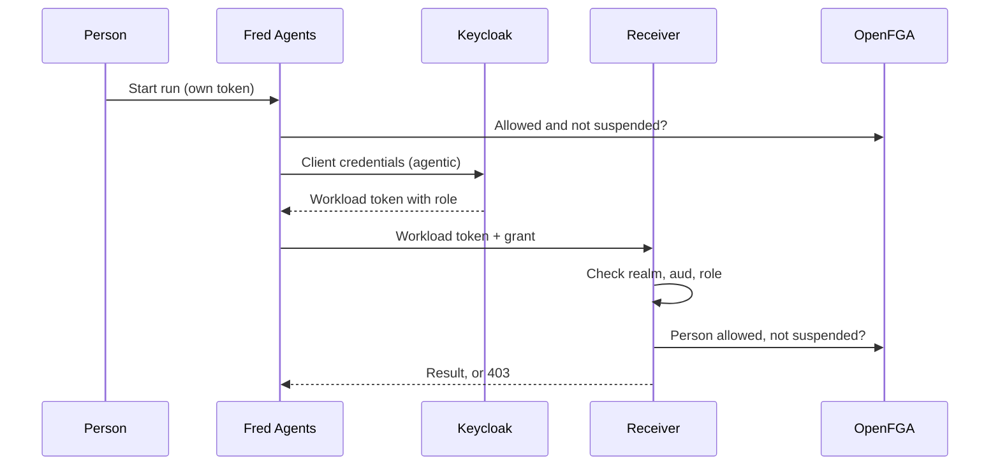

# Keycloak delegation activation

How to switch on Fred's delegated agent execution with Keycloak: Fred 3.0.0 or later on
Kubernetes with Fred's Helm chart, Keycloak 26.x and OpenFGA 1.10 or later. Step 1
(deploying the release with delegation off) is brief; steps 2-4 are the activation itself,
done with the Keycloak admin console, `kubectl` and Prometheus.

| Step | What | Where |
| --- | --- | --- |
| 1 | Deploy the release with delegation off | Cluster |
| 2 | Prerequisites | OpenFGA, Keycloak, network, edge |
| 3 | Switch on | Helm values or ConfigMaps, Keycloak |
| 4 | Check before reopening traffic | Cluster, Keycloak, Prometheus |

## 1. Deploy the release with delegation off

Upgrade with both switches `false` (the default) and no caller-role assignment, and apply the
release's database migrations. Before admitting traffic, check ordinary login, document
access, agent execution, service-to-service cleanup and token renewal on a long request, with
no unexpected 401 or 403. Keep the previous chart, images and effective values for rollback.
Do not start step 2 until this is healthy.

**Why:** the release changes behaviour even with delegation off: service-token renewal with a
bounded 401 retry, 403 authorization responses carrying `X-Fred-Denial-Cause` and new frontend
contracts. Prove it on its own before switching anything on.

If a deployment repository manages the cluster, carry the values you set by hand in steps 2-3
into it. This repository's k3d values (`k3d-apps/fred/values.yaml`) switch delegation on at
install, so a k3d cluster from here has no "off" phase.

## Before you start (steps 2-4)

### What delegation changes

When a person runs an agent, Fred Agents calls Control Plane and Knowledge Flow with **its own
workload token** plus a plain **grant** naming the `person`, the `run` and the `agent`. The
receiving service believes the named person only when the token proves the caller is a
trusted workload. It then authorizes the call as that person, with their current permissions
and account status. The person's own login token is used only to start the run, so a long run
does not depend on its lifetime.



Receiver = Control Plane or Knowledge Flow. A receiving service trusts a grant only when
**all** of these hold for the caller's token:

- it is a valid access token signed by the trusted realm;
- `aud` contains `fred-delegation`;
- `resource_access.fred-delegation.roles` contains `delegation_caller`;
- it was issued to a client that is not a login client (`security.user.client_id`, or a client
  listed in `security.delegation.user_clients`);
- with `service_accounts_only: true`, it was issued to a client's own service account.

The named person must then not be `suspended` and must hold the permission for the action.

### Names used in this runbook

| Object | Where it is set | Default | What it is for |
| --- | --- | --- | --- |
| Login client | Keycloak client; `security.user.client_id` on every service | `app` | People sign in through it. Receivers never accept a grant from a token issued to it, so a person can never name another person. |
| Agent workload client | Keycloak client; `security.m2m.client_id` on Fred Agents | `agentic` | Fred Agents obtains its own token from it with the client-credentials grant and presents that token on every delegated call. Its service account is the only holder of the caller role; any other runtime that signs in as `agentic` holds it too, so give each other agent runtime its own client. |
| Agent workload secret | Environment variable named by `security.m2m.secret_env_var` | `KEYCLOAK_AGENTIC_CLIENT_SECRET` | Proves to Keycloak that the caller is Fred Agents. Read once at process start, so a new secret needs a restart. |
| Delegation client | Keycloak client | `fred-delegation` | Owns the caller role. Its name is the audience receivers require (`security.delegation.audience`). It issues no tokens. |
| Caller role | Client role of `fred-delegation` | `delegation_caller` | The allow-list. A receiver believes a named person only from a token that carries it (`security.delegation.caller_role`). |
| Service identities | Keycloak clients of the other services | `control-plane`, `knowledge-flow`, `fred-evaluation-worker`, knowledge-base pods (`kb-fred.samples` on Docker) | Act as themselves, with Fred's service-identity shortcuts. They never hold the caller role. |

### Manual changes and controllers

If Helm or a GitOps controller manages these objects, the next upgrade or sync reverts a
manual change: a controller with self-heal undoes a `kubectl scale` or a ConfigMap edit within
minutes. For the window, pause automated sync on the Fred applications. Afterwards, write the
same values into the source that manages them (Helm values, Git) before resuming sync.

### You need

- Step 1 done: the release is deployed and healthy with both switches off.
- Keycloak realm administrator access.
- `kubectl` on the Fred namespace (`export NS=<namespace>`; `fred` on this repository's k3d),
  and administrator access to the ingress or WAF in front of Fred.
- Prometheus scraping the Fred services; Grafana is optional.
- A maintenance window (step 3 stops agent work), one normal test user and one throwaway test
  user.
- Copies of everything you are about to change (ConfigMaps, ingress configuration, Keycloak
  client settings and role mappings), for rollback.

## 2. Prerequisites

Model, identities, transport and edge, all in place before any switch changes.

### 2.1 OpenFGA 1.10 or later, with a model that defines `suspended`

1. Check the server version. The tag must be `v1.10.0` or later (this repository pins
   `v1.11.0` on k3d and `v1.15.1` on Docker):

   ```bash
   kubectl -n "$NS" get deploy openfga \
     -o jsonpath='{.spec.template.spec.containers[0].image}'
   ```

2. Run more than one OpenFGA replica in production. With delegation on, an OpenFGA outage
   refuses every authenticated request; this repository's k3d runs a single replica.
3. Check the `security.rebac` block of Control Plane, Knowledge Flow and Fred Agents:
   `type: openfga`, the same `store_name` (default `fred`), and `security.user.enabled` and
   `security.m2m.enabled` both `true`. Leave `sync_schema_on_init` at its default `true`
   there; a first-party application backend keeps it `false` and reads the model these
   services publish.
4. Reach OpenFGA. The port is the one in `security.rebac.api_url`: `8080` in Fred's chart,
   `9080` on this repository's k3d. If OpenFGA requires a key, keep it off the command line:
   pipe `printf 'Authorization: Bearer %s\n' "$FGA_TOKEN"` into each `curl` call below and
   add `-H @-`, and export it as `FGA_API_TOKEN` for `fga`, which reads it from there:

   ```bash
   kubectl -n "$NS" port-forward svc/openfga 18080:<port>   # in a second terminal
   export FGA_URL=http://localhost:18080
   STORE_ID=$(curl -s "$FGA_URL/stores" \
     | jq -r '.stores[] | select(.name=="fred") | .id')
   ```

5. If a service sets `sync_schema_on_init: false`, write the model from the release's source
   tree yourself, then point `authorization_model_id` on every such service at the ID it
   prints (or remove the pin to use the latest model):

   ```bash
   fga model write --api-url "$FGA_URL" --store-id "$STORE_ID" \
     --file libs/fred-core/fred_core/security/rebac/schema.fga
   ```

6. Check that the store's latest model defines `suspended` on `organization` (expected
   output: `true`):

   ```bash
   curl -s "$FGA_URL/stores/$STORE_ID/authorization-models?page_size=1" \
     | jq '.authorization_models[0].type_definitions[]
           | select(.type=="organization") | .relations | has("suspended")'
   ```

**Why:**

- Account status is one relation on the organization, `suspended: [user]`: a person is active
  unless suspended. With delegation on, every authenticated request makes one account-status
  check before its route runs, whether it comes from a person, a person named by a grant or a
  service identity, and a delegated run checks again before every tool call. A service with
  delegation on refuses to start with a model that does not define the relation.
- Availability: during an OpenFGA outage, every authenticated request, login bootstrap
  included, answers `503` with `X-Fred-Denial-Cause: account_status_unavailable`. Tool mounts
  still initialize and list tools; each tool call is refused.
- Version 1.10: deleting a person writes the suspension first, and a retried delete writes it
  again. That relies on OpenFGA ignoring a duplicate write, which needs 1.10 or later.
- `sync_schema_on_init: true` makes each service write the model it ships with at startup and
  use that model's ID, so the release publishes and selects its own model. A pinned
  `authorization_model_id` is ignored while sync is on. With sync off, the pin decides, and a
  stale pin keeps the service on an old model.
- `security.user.enabled` and `security.m2m.enabled`: with delegation on, a service whose
  authorization would not be enforced (no OpenFGA, or either authentication half off) refuses
  to start.

### 2.2 Keycloak

The checks for all of 2.2 are in [4.2](#42-keycloak). This repository's Docker Compose and k3d
post-install scripts already create `fred-delegation` and `delegation_caller` and assign the
role to `agentic`'s service account, and both realms give `agentic` a Client ID mapper that
writes the `client_id` claim 2.2.6 relies on. On those stacks, 2.2.1-2.2.4 are checks, not
changes.

#### 2.2.1 Create the delegation client, `fred-delegation`

Clients → Create client:

- Client type: OpenID Connect. Client ID: `fred-delegation`.
- Capability config: Client authentication **On**, Authorization Off, and **untick every
  flow**: Standard flow, Direct access grants, Implicit flow, Service account roles, Standard
  Token Exchange, OAuth 2.0 Device Authorization Grant, OIDC CIBA Grant.
- Login settings: leave empty. Save.

**Why:**

- The client ID is a name receivers look for, not a login surface. Keycloak writes a client's
  roles under `resource_access.<client ID>.roles`, and the `roles` client scope adds that
  client to `aud` whenever a token carries one of its roles. Fred's defaults
  (`security.delegation.audience: fred-delegation`, roles read from
  `resource_access.fred-delegation.roles`) match this name, so no Fred setting changes. With
  another name, set `security.delegation.audience` on every service.
- No flows: nothing can ever obtain a token *from* this client. It only owns the role and
  gives the audience its name.

#### 2.2.2 Create the caller role, `delegation_caller`

fred-delegation → Roles → Create role → `delegation_caller` (description: "Workload that may
speak for a person").

**Why:** this role is the allow-list. Receivers keep no list of callers: a workload is trusted
to name a person exactly when its token carries this role. Fred's default
`security.delegation.caller_role` is `delegation_caller`.

#### 2.2.3 Check the agent's workload client, `agentic`

- Clients → agentic → Settings → Capability config: Client authentication On, **Service
  account roles On**, everything else off (Standard flow, Direct access grants, Implicit flow,
  Standard Token Exchange, Device, CIBA).
- Client scopes tab: `roles` is assigned as Default.
- `agentic-dedicated` → Scope: *Full scope allowed* is On. If it is Off, add
  `fred-delegation` / `delegation_caller` to that scope's role mappings when you do 2.2.4.
- If you will set `service_accounts_only` (2.2.6), keep the `profile` scope and a source of
  the `client_id` claim on this client: the `service_account` scope (Keycloak 26.1 and later)
  or a Client ID user-session-note mapper, as this repository's realms use.

**Why:**

- Fred Agents obtains its workload token from this client with the client-credentials grant,
  using `security.m2m.client_id`, `realm_url` and the secret held in the variable named by
  `security.m2m.secret_env_var`. The token's `azp` is `agentic`, and its service account
  (`service-account-agentic`) is the identity that holds the role.
- Service account only: a person must never be able to sign in through a workload client and
  get a token that carries the caller role.
- `roles` scope and full scope: holding the role is not enough, the role has to be written
  into the token. With both, Keycloak adds `resource_access.fred-delegation.roles:
  ["delegation_caller"]` and adds `fred-delegation` to `aud`, which are the two things
  receivers check.

#### 2.2.4 Assign the role to the agent's service account, inside the step 3 window

In 3.4, after draining and before Fred Agents starts again: Clients → agentic → Service
account roles → Assign role → client roles → `fred-delegation` / `delegation_caller` →
Assign.

**Why:**

- This single assignment is what makes Fred Agents a trusted delegation caller.
- Timing: a holder of the role loses Fred's service-identity shortcuts at once, whatever the
  switches say. Assigned days ahead, Fred Agents' own calls would lose those shortcuts before
  delegation is on. Fred Agents caches its token, so the role only reaches its token after a
  restart or a renewal.

#### 2.2.5 Never give `delegation_caller` to

`control-plane`, `knowledge-flow`, `fred-evaluation-worker`, the knowledge-base pod clients,
the login client `app`, any person, any group, or any default or composite role.

**Why:** these identities act as themselves. The role would remove their service-identity
shortcuts, so their own calls would start failing with 403, and every holder can name any
person. People never delegate; receivers refuse login-client tokens anyway.

#### 2.2.6 Optional: `service_accounts_only`

With `security.delegation.service_accounts_only: true` on each receiver, a token counts only
if Keycloak issued it to a client's own service account: its `preferred_username` is
`service-account-<client>` and it carries the `client_id` claim, from the `service_account`
scope (Keycloak 26.1 and later) or a per-client Client ID mapper. This repository's k3d sets
it on both receivers.

**Why:** a person's token can then never delegate, even if a role is assigned by mistake.

### 2.3 Encrypted transport between services

Choose one:

- **Service mesh with strict mutual TLS** in the Fred namespace, for example Istio with
  `PeerAuthentication` mode `STRICT`. No Fred URL changes; plaintext connections are refused.
- **Native TLS**: serve HTTPS inside the cluster for Control Plane, Knowledge Flow, Keycloak
  and OpenFGA, switch every internal URL to `https://` (Knowledge Flow base URL, MCP server
  URLs, Keycloak realm and internal URLs, OpenFGA `api_url`), and make the services trust your
  internal CA.

Cover these paths: Fred Agents → Control Plane and Knowledge Flow (REST and MCP); every
service → Keycloak (tokens and signing keys); every service → OpenFGA. Keep these URLs
in-cluster: a delegated call routed through the edge carries grant parameters and is refused
by the 2.4 rule.

**Why:**

- The workload token is a bearer credential and the grant is unsigned. Anyone who can read
  in-cluster traffic can reuse the token until it expires and name any person with it. Fred
  adds no cryptography to the grant; the transport protects it.
- Delegated traffic and its token, key and authorization dependencies need authenticated,
  encrypted transport with no plaintext fallback. This repository's Docker Compose and k3d
  stacks use plain HTTP between services (on k3d, for example `http://keycloak:8080` and
  `http://openfga:9080`) and do not meet it: use them for rehearsal only.

### 2.4 Edge rule against grant parameters from outside

1. At the ingress, load balancer or WAF in front of Fred, refuse with `403` any external
   request whose query, once URL-decoded, carries `person`, `run` or `agent` as a whole
   parameter name. As a regular expression over the decoded query string:

   ```text
   (^|&)(person|run|agent)=
   ```

2. If your edge supports it, run the rule in log-only (preview) mode first and read its hits
   over normal traffic. A hit on real user traffic means the match is wrong; fix it before
   enforcing.
3. Enforce it, then run the checks in [4.3](#43-transport-and-edge).

This repository's Docker Compose and k3d stacks are local and ship no such rule.

**Why:**

- Grant fields are ordinary query parameters. Only workloads inside the cluster may send them;
  a request from the internet that carries one is never legitimate, so the ingress refuses
  it.
- Receivers already refuse a grant from a caller without the role (403). The edge rule refuses
  it before it reaches any service: a second layer, and it keeps grant-shaped requests out of
  the services entirely.
- Decode the query first: an edge that matches the raw string misses `%70erson`, which the
  services decode to `person`. Anchor on the whole parameter name, so that a query parameter
  that merely starts with one of these words, such as `agent_instance_id`, still passes.
- Preview first: a wrong match in enforce mode would refuse real traffic. Preview only logs
  what would have been refused.
- The rule checks query strings only. A grant in a JSON body still needs a token with the
  caller role at the receiver.
- If Helm or Git manages the edge configuration, add the rule there too, or the next upgrade
  can drop it.

## 3. Switch on

Receivers first, Fred Agents last, inside one maintenance window. Configuration is read only
at startup: every change below needs a restart of the pods that read it.

### Where the switches live

Each service reads `security.delegation` from its `configuration.yaml`, mounted from a
ConfigMap. To find the ConfigMap a Deployment mounts:

```bash
kubectl -n "$NS" get deploy <name> \
  -o jsonpath='{.spec.template.spec.volumes[*].configMap.name}'
```

Fred's chart renders those files from its `deploy/charts/fred/values.yaml`, where the defaults
are off:

| Service | Default in the chart | Set |
| --- | --- | --- |
| Control Plane backend and worker | `x-cp-security.delegation`, shared by `control-plane-backend` and `control-plane-worker` | `accept_delegated_calls: true` |
| Knowledge Flow backend and every worker | `x-kf-security.delegation`, shared by `knowledge-flow-backend` and `knowledge-flow-worker`; the extraction workers inherit from `knowledge-flow-worker` | `accept_delegated_calls: true` |
| Fred Agents | `applications.fred-agents.configuration.security.delegation` | `act_for_people: true` |

Everything else stays `false`: `act_for_people` on Control Plane and Knowledge Flow, and
`accept_delegated_calls` on Fred Agents (`true` only if another workload calls Fred Agents on
behalf of people).

Keep the chart defaults off and set the switches in your deployment's values file. The two
shared blocks are YAML anchors, resolved when the chart's own file is parsed, so a `-f` values
file or `--set` does not flow through them. Set each application:

```yaml
applications:
  control-plane-backend:
    configuration:
      security:
        delegation:
          accept_delegated_calls: true
  control-plane-worker:          # only if you enable it
    configuration:
      security:
        delegation:
          accept_delegated_calls: true
  knowledge-flow-backend:
    configuration:
      security:
        delegation:
          accept_delegated_calls: true
  knowledge-flow-worker:         # the extraction workers inherit from it
    configuration:
      security:
        delegation:
          accept_delegated_calls: true
  fred-agents:
    configuration:
      security:
        delegation:
          act_for_people: true
```

This repository's k3d values (`k3d-apps/fred/values.yaml`) set exactly these switches, plus `service_accounts_only: true` on both
receivers. They also set the `c3` profile on every backend: strict issuer and audience, so
browser tokens need `aud` `app` from the realm's `fred-app-audience` mapper, and
`openai_compat: false` on Fred Agents.

Optional keys, per service: `audience`, `caller_role`, `caller_roles_claim`,
`service_accounts_only` and `user_clients`. Leave them at their defaults unless your Keycloak
names differ; `service_accounts_only: true` on the receivers is the hardening in
[2.2.6](#226-optional-service_accounts_only).

**A `helm upgrade` does not keep the order of 3.2-3.4 by itself.** The chart stamps a checksum
of each application's configuration on its pods, so an upgrade that changes these values
restarts every affected pod in the same rollout. It also sets each Deployment's replica count
from `replicaCount`, which undoes the scale-down of 3.1, and it renders a `replicaCount` of
`0` as one replica. Either apply two upgrades (first the receivers, with
`applications.fred-agents.deployment.enabled: false`; then, after 2.2.4, Fred Agents with its
Deployment enabled again), or edit the ConfigMaps directly during the window and write the
values back before resuming sync.

Locally, do not edit `apps/*/config/configuration_prod.yaml` in the fred repository:
`make delegation` there turns the same switches on through ignored
`config/.delegation.local.json` files.

**Why each switch:**

- `accept_delegated_calls` (incoming): believe the person a calling workload names, when its
  token passes the checks above.
- `act_for_people` (outgoing): during a person's run, call other services with the workload
  token and a grant. Only Fred Agents calls other services on a person's behalf.
- Either switch turns on account-status checks for every authenticated request the service
  serves.
- A service that accepts delegated calls and runs agents must also act for people.

### 3.1 Freeze and drain

1. Announce the maintenance window.
2. Pause automated sync for the Fred applications (in a GitOps controller, turn off auto-sync
   and self-heal).
3. Save the current ConfigMaps, the ingress configuration and the `agentic` role mappings.
4. Pause scheduled or automated agent work, such as evaluation campaigns.
5. Stop agent work:

   ```bash
   kubectl -n "$NS" scale deploy/fred-agents --replicas=0
   ```

**Why:** a mixed state is not safe. A Fred Agents pod sending grants to a service that does
not accept them yet is treated as the `agentic` identity itself, with no person, and its calls
are refused. Every attended run belongs to its HTTP response and ends when its pod stops, so
there is nothing to migrate.

### 3.2 Control Plane

On the Control Plane, and on its worker if you run one, set (in the Helm values above, or
directly in its ConfigMap):

```yaml
security:
  delegation:
    act_for_people: false
    accept_delegated_calls: true
```

Restart and wait until Ready:

```bash
kubectl -n "$NS" rollout restart deploy/control-plane-backend
kubectl -n "$NS" rollout status deploy/control-plane-backend
```

Restart `control-plane-worker` the same way if you run it.

**Why:** Control Plane receives the agent's managed-binding lookups and other delegated calls.
It is also where deleting a person writes the suspension, which it only does while its
delegation is on. At startup it checks that the selected model defines `suspended` and exits
if not, so Ready also means the model is right.

### 3.3 Knowledge Flow

Set the same block on the Knowledge Flow backend and on every worker (`knowledge-flow-worker`,
`knowledge-flow-worker-extraction-*`), then restart each and wait until Ready:

```bash
kubectl -n "$NS" rollout restart deploy/knowledge-flow-backend
kubectl -n "$NS" rollout status deploy/knowledge-flow-backend
```

Restart each worker you run the same way (`knowledge-flow-worker`,
`knowledge-flow-worker-extraction-fast`, `-medium`, `-rich`).

**Why:** Knowledge Flow receives the agent's document, search and tool calls, over REST and
MCP. The workers serve no authenticated requests and make no account-status check; they share
the block so that every Knowledge Flow process runs one configuration.

### 3.4 Fred Agents

1. Set:

   ```yaml
   security:
     m2m:
       enabled: true
       client_id: agentic
       realm_url: <realm URL>
       secret_env_var: KEYCLOAK_AGENTIC_CLIENT_SECRET
     user:
       enabled: true
     delegation:
       act_for_people: true
       accept_delegated_calls: false
   ```

2. MCP catalog: every remote server that needs authentication has `auth_mode: delegated` and
   uses the `streamable_http` or `sse` transport (a server without `auth_mode` counts as
   `user_token`). `no_token` servers stay as they are.
3. Assign the Keycloak role now ([2.2.4](#224-assign-the-role-to-the-agents-service-account-inside-the-step-3-window)).
4. Start Fred Agents again and wait until Ready:

   ```bash
   kubectl -n "$NS" scale deploy/fred-agents --replicas=<previous count>
   kubectl -n "$NS" rollout status deploy/fred-agents
   ```

**Why:**

- `m2m` is the workload identity. `client_id` tells Fred Agents which Keycloak client to
  obtain its token from; `secret_env_var` names the environment variable that holds that
  client's secret, read once at startup. `realm_url` must be your real realm (the chart ships
  a placeholder), and every service must use the same canonical realm URL: receivers check
  the workload token's issuer against it.
- `user.enabled`: a run still starts from the person's own login. Acting for people requires
  it.
- `auth_mode: delegated` makes each run open its own tool connection carrying the workload
  token and the grant. A remote server in another mode, `no_token` aside, or a `delegated`
  server on another transport, cannot serve a person's run: the run stops with
  `delegation_unavailable`.
- Fred Agents goes last, so the first grant is sent only once every receiver accepts it.

### 3.5 Optional hardening

On the receivers, set `service_accounts_only: true` (see
[2.2.6](#226-optional-service_accounts_only)). If a receiver's `security.user.client_id` is not
your login client (for example a per-agent pod's own audience client), list the login client
in `security.delegation.user_clients`.

### Rollback

1. Stop new agent work as in 3.1.
2. Fred Agents: `act_for_people: false`, and remove `delegation_caller` from `agentic` so it
   gets its service-identity shortcuts back.
3. Knowledge Flow, then Control Plane: `accept_delegated_calls: false`. Restart each.
4. Turn delegation off everywhere before pointing any service at an older OpenFGA model.
5. Start Fred Agents again (`kubectl -n "$NS" scale deploy/fred-agents --replicas=<previous
   count>`), check ordinary login, document access and agent execution, then write the values
   into their source and resume sync as in [After the checks](#after-the-checks).

Turning delegation off also turns off account-status checks: retained suspensions stop being
consulted. A deleted person cannot sign in again, but a token they still hold works until it
expires. A Helm rollback does not restore Keycloak role mappings or OpenFGA.

## 4. Check before reopening traffic

Keep the window closed until every check passes. A failed check means rollback.

### 4.1 Startup and data

- Every pod is Ready, with no restarts or `CrashLoopBackOff`, and the startup logs show no
  model or configuration error.
- This release's database migration jobs completed (`kubectl -n "$NS" get jobs`).
- Staging only: scale OpenFGA to zero and expect every authenticated request, tool
  initialization and listing aside, to answer `503` with
  `X-Fred-Denial-Cause: account_status_unavailable`; then scale it back. A `rollout restart`
  does not show this, because the old pod keeps serving until the new one is ready.

**Why:** a service with delegation on exits at startup when its model is incompatible or its
authorization would not be enforced. Ready with delegation on is the proof that both are
right for Control Plane, Knowledge Flow and Fred Agents.

### 4.2 Keycloak

- fred-delegation → Roles → delegation_caller → *Users in role*: only
  `service-account-agentic`.
- No group, default role or composite role contains `delegation_caller`.
- `fred-delegation` offers no flow.
- Get an `agentic` token and read its claims. Set `KC_URL`, `REALM` and
  `KEYCLOAK_AGENTIC_CLIENT_SECRET` first; neither the token nor the secret is printed, and the
  secret reaches `curl` on stdin:

  ```bash
  TOKEN=$(printf %s "$KEYCLOAK_AGENTIC_CLIENT_SECRET" \
    | curl -s "$KC_URL/realms/$REALM/protocol/openid-connect/token" \
        -d grant_type=client_credentials -d client_id=agentic \
        --data-urlencode client_secret@- | jq -r .access_token)

  printf %s "$TOKEN" | python3 -c '
  import sys, json, base64
  p = sys.stdin.read().split(".")[1]
  c = json.loads(base64.urlsafe_b64decode(p + "=" * (-len(p) % 4)))
  keys = ("aud", "azp", "preferred_username", "client_id", "resource_access")
  print(json.dumps({k: c.get(k) for k in keys}, indent=2))
  '
  ```

  Expect `fred-delegation` in `aud`, `["delegation_caller"]` under
  `resource_access.fred-delegation.roles`, `azp` = `agentic`, `preferred_username` =
  `service-account-agentic` and, with `service_accounts_only`, `client_id` = `agentic`.
- The same check with `fred-evaluation-worker`, `control-plane` or `knowledge-flow` shows no
  `fred-delegation` at all.
- `agentic` offers only the service-account flow.

**Why:** these are exactly the facts receivers rely on before believing a named person.

### 4.3 Transport and edge

- A plaintext request to Knowledge Flow from a pod outside the mesh (or over `http://`) fails,
  while the services' own calls succeed.
- Once the edge rule is enforced:

  ```bash
  # expect 403
  curl -s -o /dev/null -w '%{http_code}\n' "$FRED_URL/?person=someone"
  # expect anything but 403
  curl -s -o /dev/null -w '%{http_code}\n' "$FRED_URL/?agent_instance_id=x"
  ```

### 4.4 An allowed person gets through

Sign in as the normal test user and run an agent that searches documents; the answer arrives.
On Control Plane and Knowledge Flow, accepted grants rise:

```promql
sum by (outcome, reason) (
  increase(fred_auth_delegation_decisions_total[15m])
)
```

Expect `accepted` / `grant_validated` above zero and no `rejected`. If you see a rejection:

| Reason | Meaning | Look at |
| --- | --- | --- |
| `caller_not_trusted` | A complete grant from a caller without the caller role | 2.2.3 and 2.2.4: the role is missing from the agent's token, or Fred Agents still holds a token from before the assignment |
| `caller_not_allowed` | The token has the role but fails another check | `aud`, issuer, login-client list, `service_accounts_only` |
| `invalid_parameters` | Grant fields missing or malformed | Component versions: every service must run the same release |

Under the `c3` profile, a token with the wrong issuer, or one addressed only to
`fred-delegation` that comes from a login client or fails `service_accounts_only`, is refused
with `401` before any decision is counted: look for 401s in the receivers' logs.

**Why:** this proves the whole chain: token, role, audience, grant and the person's
permissions.

### 4.5 A suspended person is refused

1. As the throwaway test user, start a long run that keeps calling tools.
2. As a platform administrator, delete that user. Fred writes the suspension, then deletes the
   Keycloak account; this cannot be undone for that user. Take the ID from Keycloak → Users →
   the user → ID, and a platform administrator's access token as `ADMIN_TOKEN`. Expect `204`:

   ```bash
   printf 'Authorization: Bearer %s\n' "$ADMIN_TOKEN" \
     | curl -s -o /dev/null -w '%{http_code}\n' -X DELETE -H @- \
         "$FRED_URL/control-plane/v1/users/$TEST_USER_ID"
   ```

3. Expect the run to stop before its next tool call with reason `authority_lost`: Fred Agents
   rechecks the person's account status before every tool call, so the call does not reach a
   receiver (Fred Agents logs `[TOOL] event=tool_call outcome=stopped reason=authority_lost`).
4. Optional: reload Fred as the deleted user while their token is still valid. Requests now
   fail with `403` and `X-Fred-Denial-Cause: account_suspended` (browser network tab), and the
   receiver writes one `authorization.account.refused` audit event with reason
   `account_suspended`.

**Why:** suspension is Fred's revocation for delegated work. Disabling or deleting the account
in Keycloak alone does not stop a delegated run, because the agent uses its own token, not the
person's.

### 4.6 The workload token renews during a long run

Run an agent task that lasts longer than the `agentic` access-token lifespan (realm default,
usually 5 minutes). To shorten the test, temporarily set Clients → agentic → Advanced → Access
Token Lifespan to 2 minutes, then restore it. On Fred Agents:

```promql
sum by (operation, outcome) (
  increase(fred_auth_m2m_request_seconds_count[15m])
)
```

Expect `renewal` / `success` above zero, no `error`, a completed run, and no 401 in the
receivers' logs. Then, on Fred's admin Self-test page, run the session-expiry check ("Agent
access after your session expires"): it passes and reports that the agent held no person
credential.

**Why:** a run is not bounded by the person's token lifetime. The workload token is
cached and renewed shortly before expiry (when less than about 30 seconds remain). A short
chat after expiry does not prove renewal during a run.

### 4.7 Cleanup

Start a long run, then stop it with the Stop button. With no other traffic in the window, the
accepted-grant counter on Control Plane and Knowledge Flow stops rising shortly after. Also
stop at a human-approval step or an agent question: the run ends, and answering resumes it as a
new, freshly admitted run.

**Why:** a delegated run's authority lasts exactly as long as its HTTP response. Stopping must
end the run and its child agents and stop any further use of the workload token for it.

### 4.8 Metrics

No dashboard ships these metrics: run the queries above in Prometheus or Grafana Explore.
Prometheus must scrape all three APIs, and Fred's metrics exporter listens on `127.0.0.1`
unless `observability.kpi.prometheus.address` is `0.0.0.0`, as this repository's k3d sets it.
On that k3d, every Fred target shares `job="apps"`: select a service by its `app` label.

| Metric | Read it as |
| --- | --- |
| `fred_auth_m2m_request_seconds` | Token requests to Keycloak; `operation` initial or renewal, `outcome` success, error or cancelled |
| `fred_auth_m2m_acquire_seconds` | Caller wait, including cache and lock |
| `fred_auth_m2m_cache_total` | Cache hit, miss or shared refresh (events, not a request count) |
| `fred_auth_delegation_decisions_total` | Grant admission accepted or rejected, with its reason |

**Why:** once traffic is back, these show renewal failures and refused grants. Missing series
are not proof of zero failures: check the scrape target's `up` first.

### 4.9 Workload secret rotation drill

1. Rotate the `agentic` secret with a grace period: enable Keycloak's client secret rotation
   for this client (Realm settings → Client policies: a profile with the `secret-rotation`
   executor and a policy whose condition matches the client), then Credentials → Regenerate.
   The previous secret stays valid as the rotated secret until the grace ends.
2. Put the new value in the Secret that provides `KEYCLOAK_AGENTIC_CLIENT_SECRET` to Fred
   Agents.
3. Restart Fred Agents and wait until Ready:

   ```bash
   kubectl -n "$NS" rollout restart deploy/fred-agents
   kubectl -n "$NS" rollout status deploy/fred-agents
   ```

4. Run one agent, then rerun the 4.6 query: new pods show `initial` / `success` and no
   `error`. Then invalidate the
   rotated secret, or let it expire.

**Why:** Fred Agents reads the secret once at startup; only a restart picks up a new one. The
grace covers the rollout, while old and new pods run side by side. A run in progress keeps the
token it holds until that token expires. Without a grace, Regenerate invalidates the old secret
at once and the running pods' next renewal fails. The fred repository's
`docs/swift/ops/WORKLOAD_SECRET_ROTATION.md` is the general procedure.

### After the checks

Write every change into the source that manages it (the Helm values from step 3, Git), resume
automated sync and confirm it shows no drift, lift the announcement, and reopen traffic.
