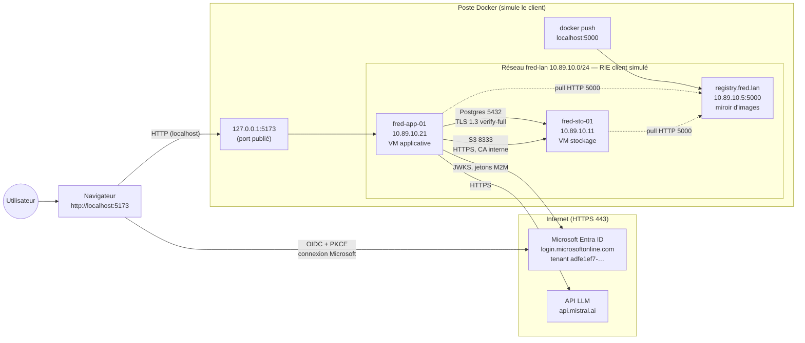
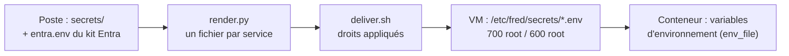
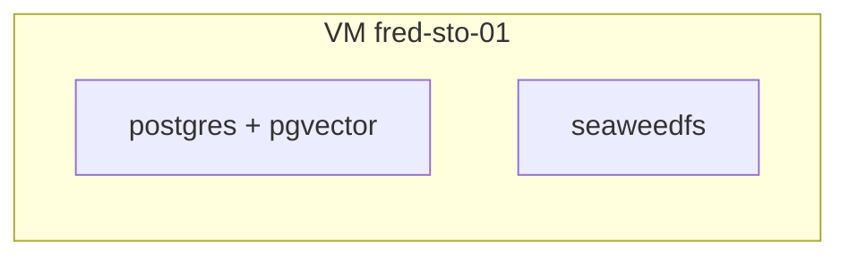
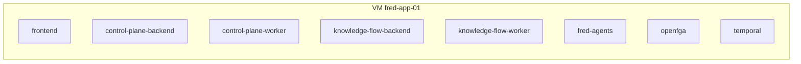
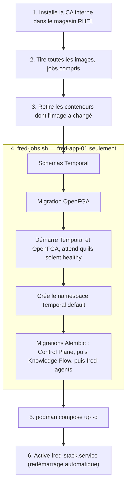

# Architecture de la maquette Fred : 2 VMs RHEL 9, podman, Entra ID, images durcies

Ce document décrit ce qui tourne réellement dans la maquette au 02/10/2026 : l'infrastructure
simulée, les deux piles podman, la chaîne d'authentification Entra ID et les images durcies.
Mise en route et dépannage : [README.md](README.md).

---

## 1. Infrastructure

Le poste Docker joue le rôle du **client** : il fournit deux « VMs » RHEL 9 (conteneurs UBI 9
avec systemd et podman) et un registry miroir, reliés par un réseau qui simule le **RIE du
client**. Le navigateur de l'utilisateur est la seule pièce qui parle à la fois à
fred-app-01 et à Microsoft Entra ID.



| De | Vers | Port | Protocole |
|---|---|---|---|
| Navigateur | fred-app-01 (frontend) | 8080, publié en `localhost:5173` | HTTP (accès local, voir §8) |
| Navigateur | Entra ID | 443 | HTTPS (OIDC, code + PKCE) |
| fred-app-01 | fred-sto-01 Postgres | 5432 | TLS 1.2+ (1.3 observé), `verify-full` |
| fred-app-01 | fred-sto-01 S3 | 8333 | HTTPS, certificat signé par la CA interne |
| fred-app-01 | Entra ID, API LLM | 443 | HTTPS |
| VMs | registry | 5000 | HTTP (maquette ; TLS chez un client) |

Tout le reste est fermé : les ports internes de SeaweedFS (9333, 8080, 8888) ne sortent pas
de fred-sto-01 ; Temporal, OpenFGA et les backends ne sortent pas de fred-app-01.

---

## 2. Gestion des secrets

Les secrets naissent sur le poste, sont rendus en un fichier par service, livrés dans les VMs
puis injectés dans les conteneurs en variables d'environnement.



### Sur le poste (source)

`secrets/` est en `0700` et ses fichiers en `0600` ; ce répertoire, comme `build/`, est exclu du
dépôt par `.gitignore`.

| Fichier | Contenu | Origine |
|---|---|---|
| `secrets/generated.env` | mots de passe Postgres (admin, `fred`, `openfga`, `temporal`), secret S3, clé OpenFGA, jeton de bootstrap | `make secrets` (`openssl rand -hex 24`), jamais écrasé |
| `secrets/llm.env` | clé de l'API LLM (Mistral) | remplie à la main |
| `secrets/pki/` | CA interne (clé et certificat), certificat et clé de fred-sto-01 | `make pki` |
| `../test-entra-perso/secrets/entra.env` | secrets des 3 clients confidentiels Entra (Control Plane, Knowledge Flow, Runtime) | kit Entra |

### Rendu et livraison

- `render.py` écrit dans `build/<vm>/etc/fred/secrets/` **un fichier par consommateur**. Les
  configurations YAML ne contiennent **aucun secret**, seulement des noms de variables
  (`secret_env_var: KEYCLOAK_…`) ; la configuration de Temporal lit son mot de passe dans
  l'environnement au démarrage (`{{ env "POSTGRES_PWD" }}`).
- `deliver.sh` copie dans la VM et applique les droits listés dans `.perms` :
  `/etc/fred/secrets` en `700 root`, chaque fichier en `600 root` ; clés TLS et `s3.json` en
  `600`, possédés par l'uid du service qui les lit (70 pour Postgres, 65532 pour SeaweedFS),
  montés en lecture seule.
- Les images ne contiennent aucun secret.

### Dans les conteneurs

Podman lit les fichiers `env_file` à la création du conteneur et les injecte en variables
d'environnement ; les fichiers eux-mêmes ne sont pas montés. Chaque conteneur ne reçoit que
ce qui le concerne :

| Fichier (VM) | Reçu par | Contenu |
|---|---|---|
| `postgres.env` (sto) | postgres | mots de passe de tous les comptes, utilisés seulement à la création des bases |
| `s3.json` (sto, monté) | seaweedfs | identité S3 (clé et secret) |
| `common.env` (app) | backends, workers et migrations Fred | mot de passe `fred`, secret S3, clé OpenFGA |
| `control-plane.env` | Control Plane (API, worker, migration) | secret Entra CP, jeton de bootstrap |
| `knowledge-flow.env` | Knowledge Flow (API, worker, migration) | secret Entra KF, clé LLM |
| `fred-agents.env` | fred-agents (API, migration) | secret Entra Runtime, clé LLM |
| `openfga.env` | openfga, openfga-migrate | URI Postgres (mot de passe inclus), clé prépartagée |
| `temporal.env` | temporal, temporal-sql | mot de passe `temporal` (`POSTGRES_PWD` pour le serveur, `SQL_PASSWORD` pour les jobs) |

### Limites

- **Variables d'environnement lisibles par root sur la VM** : `podman inspect` les affiche en
  clair, et `/proc/<pid>/environ` les expose au même utilisateur. C'est la principale faiblesse.
- **Secrets en clair sur disque** : dans les VMs (`600 root`) et sur le poste (`secrets/`, et
  `build/` qui contient les fichiers rendus).
- **Comptes partagés** : les trois backends utilisent le même compte Postgres `fred` et le
  même secret S3 (`common.env`).
- **Pas de rotation automatisée** : mots de passe Postgres figés à l'initialisation (changement
  par `ALTER ROLE`), secrets Entra à durée limitée (portail), certificat TLS par la procédure
  manuelle du README §3.

Pistes : **podman secrets** (`podman secret create`, montés en fichiers dans `/run/secrets/`)
pour sortir les secrets de `podman inspect`, à condition que Fred sache lire chacun depuis un
fichier (c'est déjà le cas du jeton de bootstrap, à vérifier pour les autres) ; un compte
Postgres et un compte S3 par backend pour limiter l'impact d'une fuite.

---

## 3. Conteneurs de chaque VM

Une pile `podman compose` par VM, dans `/opt/fred/compose.yaml`, relancée au démarrage par
`fred-stack.service`.

### fred-sto-01



### fred-app-01



### Ordre de déploiement (`fred-deploy.sh`)



Les jobs sont hors des `depends_on` : podman-compose traduit `depends_on` en
`podman --requires`, qui bloque le démarrage dès qu'un job terminé est dans la chaîne. Au
démarrage de la VM, `fred-stack.service` ne fait que `up -d` (migrations déjà appliquées).

---

## 4. Images durcies

Neuf images, construites localement par `make images` à partir de `images/<nom>/Containerfile`
(sources Fred : `FRED_REPO`), poussées dans le registry sous `fred/<nom>:hardened`.

### Méthode commune

- **Construction en deux temps** : une étape `build` (compilateurs, `uv`, téléchargements)
  qui n'est pas livrée, puis une image finale `FROM scratch` dont le système de fichiers est
  assemblé par `apk add --root` avec **les seuls paquets d'exécution**.
- **Pas de gestionnaire de paquets** dans l'image finale ; shell seulement quand un composant
  l'exige (voir tableau).
- **Utilisateur non root** fixé dans l'image ; fichiers applicatifs à root, en lecture seule
  pour l'utilisateur.
- **Base épinglée par digest** (`wolfi-base@sha256:824f77df…`).
- **Inventaire conservé pour les scanners** : base apk (`/usr/lib/apk/db/installed`),
  `/etc/os-release` et un SBOM SPDX par paquet (`/var/lib/db/sbom/`). Le venv Python garde ses
  métadonnées de paquets.
- **Images Fred** : dépendances depuis `uv.lock`, sans les extras de développement (pytest,
  bandit, ruff… présents dans les `Dockerfile-prod` d'origine) ; bytecode compilé au build.

### Caractéristiques par image

| Image | Version | Utilisateur | Shell | Gestionnaire de paquets | Taille | Healthcheck | Particularités |
|---|---|---|---|---|---|---|---|
| postgres | Postgres 17.10, pgvector 0.8.1, contrib | 70 (`postgres`) | bash + busybox (entrypoint d'init) | non | 444 Mo | `pg_isready` (socket, peer) | jamais root, init par `/var/lib/postgres/initdb/` |
| seaweedfs | 4.32 | 65532 | **aucun** | non | 228 Mo | aucun (pas de sonde possible) | binaire `weed` seul |
| openfga | 1.21.0 | 65532 | **aucun** | non | 116 Mo | `grpc-health-probe` | — |
| temporal-server | 1.31.0 | 65532 | **aucun** | non | 444 Mo | `grpc-health-probe` (service WorkflowService) | sans scripts ni dockerize : config montée, mot de passe lu dans l'environnement |
| temporal-admin-tools | 1.31 | 65532 | bash (dépendance d'un paquet, inutilisé) | non | 301 Mo | — (job) | `temporal-sql-tool`, CLI `temporal`, schémas SQL |
| control-plane-backend | Python 3.12.15 | 65532 | **aucun** | non | 1,3 Go | — | pas de dépendances de dev |
| knowledge-flow-backend | Python 3.12.15 | 65532 | busybox (+ bash, dépendance d'un paquet) | non | 11,5 Go | — | LibreOffice, ffmpeg ; modèles, encodages et extension DuckDB préchargés, hors ligne ; pandoc de `pypandoc-binary` ; sans inkscape |
| fred-agents | Python 3.12.15 | 65532 | busybox (`soffice` est un script) | non | 2,7 Go | — | LibreOffice et polices compatibles Office |
| frontend | nginx 1.31.6 | 65532 | busybox (entrypoint de Fred) + jq | non | 77 Mo | — | version masquée (`server_tokens off`), sans curl ni unzip |

### Durcissement à l'exécution (compose et podman)

Appliqué à **tous** les conteneurs des deux VMs (`x-hardening` dans chaque compose) :

| Mesure | Réglage |
|---|---|
| Racine en lecture seule | `read_only: true` ; seuls des `tmpfs` déclarés s'écrivent (`noexec`, taille bornée, possédés par l'utilisateur du conteneur via `U`) |
| Capabilities | `cap_drop: [ALL]` (aucune n'est rendue) |
| Élévation de privilèges | `security_opt: [no-new-privileges]` |
| Ressources | `mem_limit` et `pids_limit` par service |
| Secrets | un fichier `env_file` par consommateur, `0600 root`, jamais monté dans le conteneur |
| Défauts podman des VMs | `containers.conf.d/60-fred-hardening.conf` : `read_only`, `label` (SELinux), `pids_limit` |

Répertoires inscriptibles par service : `/tmp` partout ; `$HOME` pour le Control Plane et
fred-agents ; `~/.config`, `~/.cache`, `~/.fred`, `~/.paddlex` pour Knowledge Flow (son `$HOME`
contient l'extension DuckDB préchargée, en lecture seule) ; `/var/run/postgresql` pour
Postgres ; `/var/lib/fred/theme` pour le frontend.

---

## 5. Wolfi en bref

[Wolfi](https://github.com/wolfi-dev) est une distribution Linux minimale de Chainguard,
conçue pour les conteneurs : paquets `apk` basés sur glibc, recompilés en continu sur les
dernières versions corrigées, signés, avec un SBOM par paquet. Elle sert ici de **source de
paquets binaires** (Python, Postgres, LibreOffice, Temporal, OpenFGA, nginx…) ; les images
sont **construites localement** et le code de Fred est installé par nos soins. Elle a été
retenue parce qu'UBI 9 ne fournit ni LibreOffice, ni ffmpeg, ni pgvector, ni SeaweedFS,
OpenFGA ou Temporal. Conséquence : les versions suivent Wolfi (dépôt « roulant ») ;
`make images REFRESH=1` reconstruit sans cache pour récupérer les derniers correctifs.

---

## 6. Chiffrement et confiance

| Élément | Rôle |
|---|---|
| CA interne (`secrets/pki/`) | signe le certificat de `fred-sto-01.fred.lan` (Postgres et S3) |
| `PGSSLMODE=verify-full` + `PGSSLROOTCERT` | psycopg et asyncpg chiffrent et vérifient le nom du serveur |
| Bundle système RHEL (CA publiques + CA interne) | monté en `SSL_CERT_FILE` et **à la place du magasin de CA de l'image** : DuckDB `httpfs` (curl embarqué) ne lit que ce dernier |
| Temporal, OpenFGA | TLS `verify-full` vers Postgres, par configuration |

---

## 7. Écarts avec les images et la configuration d'origine

- Postgres 15 → **17** (pgvector n'existe dans Wolfi qu'à partir de 16) ; Temporal 1.28 → **1.31** ;
  OpenFGA 1.15 → **1.21** ; SeaweedFS 4.29 → **4.32**.
- Pas d'OpenSearch : vecteurs dans pgvector, logs sur la sortie standard (journald),
  `log_store: in_memory` pour la copie consultable dans l'UI.
- **inkscape retiré** : les images EMF des DOCX restent en EMF (Fred le journalise).
- **Thème téléchargé du frontend** (`FRONTEND_THEME_URL`) non pris en charge (ni curl ni unzip).
- **SeaweedFS sans healthcheck** ; `make verify` contrôle S3 en HTTPS depuis fred-app-01.

---

## 8. Limites connues et suites possibles

- **LibreOffice hors du `PATH`** dans knowledge-flow-backend et fred-agents
  (`/usr/lib/libreoffice/program`) : conversions `.doc`/`.ppt`/`.xls` et aperçu PowerPoint en
  échec tant que l'image n'est pas reconstruite avec ce `PATH`.
- **URL présignées pour le navigateur** (avatars, bannières) : signées pour fred-sto-01, que le
  navigateur ne joint pas ; demande une route S3 côté reverse proxy (README §3, point 5).
- **Accès navigateur en HTTP** sur `localhost` : chez un client, HTTPS via son reverse proxy,
  et l'URL exacte ajoutée aux redirect URIs de « Fred UI ».
- **Podman rootful** et **SELinux non testé** (désactivé dans un conteneur). Étapes suivantes
  possibles : `userns=auto` (chaque conteneur dans son propre espace d'UID) ou podman rootless,
  puis validation en SELinux *enforcing* sur une vraie RHEL.
- **Registry en HTTP** : TLS chez un client (`simulation/vm/registries.conf`).
- **Taille des images Fred** : due aux dépendances Python elles-mêmes (Google, pyarrow,
  modèles) ; à traiter dans Fred, pas dans l'image.
- **Défaut Fred** : `pgvector_store._create_store` passe `connection_string` à langchain-postgres
  (qui attend `connection`) et retombe sur l'implémentation historique, avec une `ERROR` au
  démarrage, sans effet fonctionnel.

---

## 9. Commandes

```bash
make images                     # construit les 9 images (ONLY="nom …", REFRESH=1 sans cache)
make vms                        # registry + 2 VMs
make registry-push              # pousse les images dans le registry
make deploy                     # livre les bundles, déploie stockage puis applicatif
make verify                     # chiffrement, refus du clair, configuration OIDC
make bootstrap-token            # jeton du premier administrateur
make status / make logs VM=… C=…
```

Après une modification du code Fred : `make images ONLY="<image>"`, `make registry-push`,
`make deploy-app` (le conteneur dont l'image a changé est recréé automatiquement).
